  

## 📌 About Me
- 🔭 I’m currently working as a **student**
- 🌱 I’m currently learning **Go Lang , AWS**
- 💬 Ask me about **Html, Css, Js, React, Next JS... or anything [here](https://github.com/AnujTiwari-Student)**
- ⚡ Connect With me **anujavengers@gmail.com**

## 🧠 My Focus Areas
- Web Devlopment
- DevOps
- DevSecOps

## 📊 GitHub Stats & Trophies

  
  

  

## 🛠️ Languages & Tools

> ## Programming Languages

  

> ## Frontend

    

> ## Backend

 

> ## Database

  

> ## DevOps & Cloud

  

> ## Tools

    

  

## 🔗 Connect with Me

   

<picture>
  <source media="(prefers-color-scheme: dark)" srcset="https://raw.githubusercontent.com/AnujTiwari-Student/AnujTiwari-Student/output/commit-invaders-dark.svg" />
  <source media="(prefers-color-scheme: light)" srcset="https://raw.githubusercontent.com/AnujTiwari-Student/AnujTiwari-Student/output/commit-invaders.svg" />
  
</picture>

  

